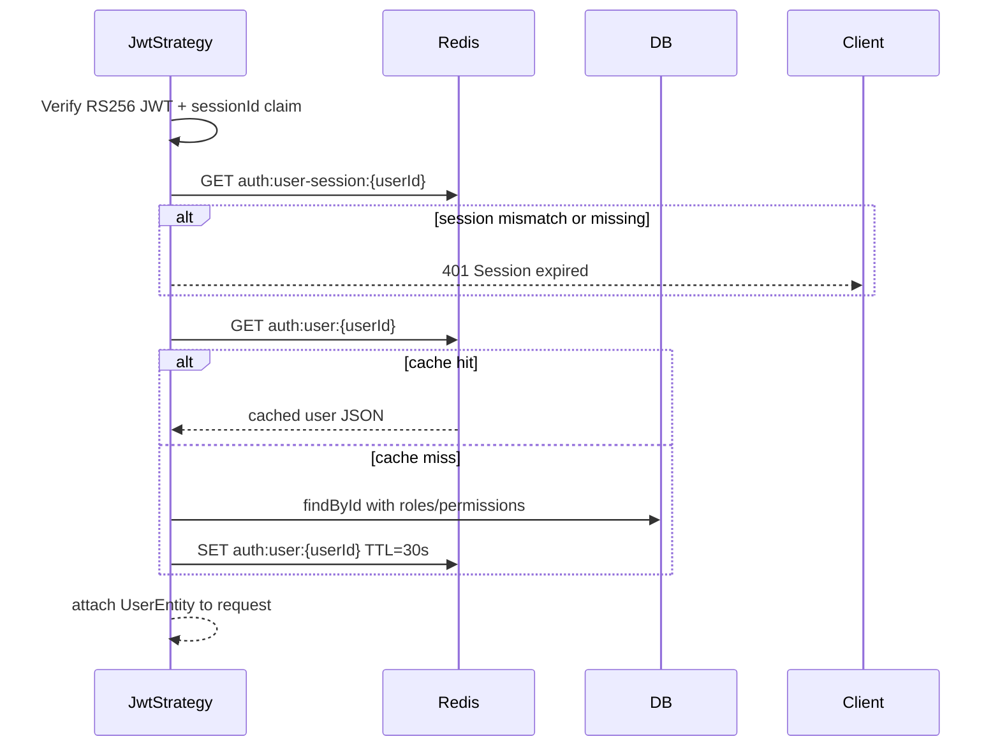

# Cache (Backend)

Redis-backed caching via `RedisCacheService` (`src/modules/cache/redis-cache.service.ts`). In this base project, Redis is used primarily for **auth session** and **auth user** caching. A **versioned cache** API is also provided for future read-heavy endpoints.

Auth flows that depend on Redis: [auth.md](./auth.md).

## Enable Redis

```env
REDIS_CACHE_ENABLED=true
REDIS_HOST=127.0.0.1
REDIS_PORT=6379
REDIS_DB=0
REDIS_PASSWORD=
```

| `REDIS_CACHE_ENABLED` | Behavior |
|-----------------------|----------|
| `false` | `RedisCacheService` no-ops; **auth login fails** (`503`) and JWT validation fails (`401`) |
| `true` | Connect on module init; auth session + user cache active |

Connection uses `ioredis` with short timeouts (1s connect/command), `lazyConnect`, and `enableOfflineQueue: false`. On connect failure, service logs a warning and operations fall back to no-op / DB — which breaks auth session semantics.

**For local dev:** run Redis (e.g. `docker run -p 6379:6379 redis:7-alpine`) and set `REDIS_CACHE_ENABLED=true`.

## Auth cache keys

Defined in `src/modules/auth/auth-redis.constants.ts`:

| Key pattern | Value | TTL | Written by | Read by |
|-------------|-------|-----|------------|---------|
| `auth:user-session:{userId}` | `sessionId` (UUID) | `JWT_EXPIRATION_TIME` | `AuthService` on login / Google login | `JwtStrategy` on each request |
| `auth:user:{userId}` | JSON user + roles + permissions | **30s** (`AUTH_USER_CACHE_TTL_SECONDS`) | `JwtStrategy` on cache miss | `JwtStrategy` on cache hit |

### Session invalidation

| Event | Effect |
|-------|--------|
| New login (same user) | Overwrites `auth:user-session:{userId}` → previous JWTs invalid |
| Password reset | `DELETE auth:user-session:{userId}` |
| Logout endpoint | Not implemented in base — session expires by TTL or new login |

### User cache invalidation

`UserService` deletes `auth:user:{userId}` when:

- Password updated
- Legacy role updated
- Email verified
- RBAC roles assigned (`assignRolesToUser`)

JWT still carries `permissions` from issuance time; user cache refresh picks up DB changes within TTL (30s) or immediately after invalidation.

## RedisCacheService API

| Method | Purpose |
|--------|---------|
| `getString` / `setString` | Auth session storage |
| `getJson` / `setJson` | Auth user cache |
| `delete` | Session / user cache invalidation |
| `getOrSetVersioned` | Versioned read cache with stampede lock |
| `incrementVersion` | Bump version key to invalidate a cache namespace |
| `buildStableHash` | Deterministic hash for cache keys from query objects |

### Versioned cache pattern (extension point)

For list/report endpoints, use:

```typescript
await this.redisCacheService.getOrSetVersioned({
  versionKey: 'my-feature:version',
  keyPrefix: 'my-feature:list',
  identity: { page, filters },
  ttlSeconds: 60,
  logContext: 'my-feature list',
  loader: () => this.repository.find(...),
});

// On write/mutation:
await this.redisCacheService.incrementVersion('my-feature:version', 'my-feature invalidate');
```

Cache key shape: `{keyPrefix}:v{version}:{queryHash}`.

`getOrSetWithLock` uses Redis `SET NX EX` (3s lock) with retries at 50/100/150ms to reduce thundering herd on cache miss.

**Note:** No feature module in base currently calls `getOrSetVersioned` — infrastructure is ready when you add read-heavy APIs.

## Request validation flow



## Logging

Cache operations log context strings for observability, e.g.:

- `auth-session login userId=...`
- `auth-user validate userId=...`
- `auth-user cache hit userId=...`
- `cache hit` / `cache miss-set` / `cache wait-hit` / `cache fallback-db` (versioned API)

## Module layout

| Path | Responsibility |
|------|----------------|
| `src/modules/cache/cache.module.ts` | Exports `RedisCacheService` |
| `src/modules/cache/redis-cache.service.ts` | Redis client + cache helpers |
| `src/modules/auth/auth-redis.constants.ts` | Auth key prefixes and TTLs |

## Production checklist

- [ ] Dedicated Redis instance (not shared dev container in prod)
- [ ] `REDIS_CACHE_ENABLED=true`
- [ ] Monitor Redis memory and eviction policy
- [ ] Auth session TTL aligned with `JWT_EXPIRATION_TIME`
- [ ] After RBAC changes, user cache invalidates via `UserService` — verify admin role assignment paths call invalidation
