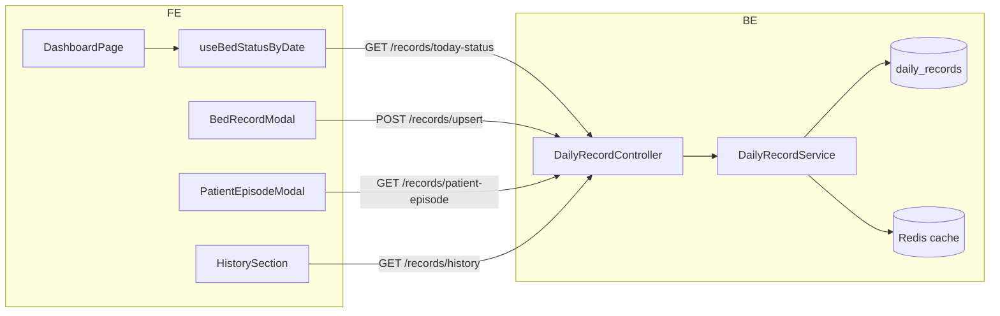

# Daily Record (`/records`)

Module quản lý **bản ghi sinh tồn theo ngày / theo giường** (mạch, nhiệt độ, huyết áp, tên bệnh nhân) cho từng ca **Sáng** và **Chiều**.

**Source:** `src/modules/daily-record/`  
**Controller:** `daily-record.controller.ts`  
**Frontend:** `InSight-Care-FE/src/components/records/`, `InSight-Care-FE/src/components/patient/`, `InSight-Care-FE/src/components/history/`

Cache invalidation for today status: [cache.md](./cache.md).

## Architecture



| Endpoint | Purpose | Frontend consumer |
|----------|---------|-------------------|
| `GET /records/today-status` | Bed vitals status for a business day | Main vitals table (3s polling when viewing today) |
| `POST /records/upsert` | Create or update today's record for a bed | Bed record modal |
| `GET /records/patient-episode` | Patient stay episode with chart-ready vitals | Patient episode modal (click patient name) |
| `GET /records/history` | Search historical records | History section (secondary) |

## FE main features

| # | Feature | API |
|---|---------|-----|
| 1 | Daily vitals table (all beds, pick date, enter shifts) | `today-status` + `upsert` |
| 2 | Patient detail (click name → episode charts + daily table) | `patient-episode` |

All endpoints require `@Auth()` (JWT).

## Database fit (no migration required)

The existing `daily_records` schema is sufficient for both main features:

| Need | Existing schema |
|------|-----------------|
| One record per bed per day | Unique `(business_day_at, bed_id)` |
| Patient identity (MVP) | `morning_patient_name`, `evening_patient_name` strings |
| Vitals for charts | `morning_*`, `evening_*` columns |
| Bed metadata | Join `beds` → `rooms` |

Patient **episodes** are derived in application logic from `daily_records` — no `patients` or `patient_episodes` tables in MVP.

Episode rules (per `bedId` + normalized patient name):

- **Start / end:** first and last day the name appears on that bed.
- **Gap days** (no name on either shift) do **not** split an episode.
- **Another patient's name** on a day splits episodes.

## Data model

Table: `daily_records` (`DailyRecordEntity`)

Unique index: `(business_day_at, bed_id)` — at most **one record per bed per business day**.

| Column | Description |
|--------|-------------|
| `business_day_at` | Start of VN business day (00:00 `Asia/Ho_Chi_Minh`, stored as UTC instant) |
| `bed_id` | Bed UUID |
| `morning_patient_name`, `morning_pulse`, `morning_temp`, `morning_bp` | Morning shift (0h–11h59 VN) |
| `evening_patient_name`, `evening_pulse`, `evening_temp`, `evening_bp` | Evening shift (12h–23h59 VN) |
| `is_locked` | `true` after end-of-day lock — upsert rejected |

### Business day & shifts

Helpers: `src/common/vietnam-date.ts`

| Concept | Rule |
|---------|------|
| Business day | Calendar date in `Asia/Ho_Chi_Minh` |
| `serverDate` | `getTodayYmdVN()` — today's date on the server |
| `editableShift` | VN hour `< 12` → `morning`; `>= 12` → `evening` |
| End-of-day lock | Cron at `23:59:59` VN (`DailyRecordLockCron`) sets `is_locked = true` for all unlocked records today |

## API reference

### `GET /records/today-status`

Returns all beds with their record for the requested day plus metadata for the UI.

#### Query (`StatusQueryDto`)

| Param | Required | Description |
|-------|----------|-------------|
| `date` | No | Omit, empty, or `"today"` → server today. `YYYY-MM-DD` → view a past day. Future dates → `400`. |

#### Response (`IBedStatusResponseDto`)

```typescript
{
  serverDate: string;        // e.g. "2026-06-20"
  editableShift: 'morning' | 'evening';
  requestedDate: string;     // resolved date being viewed
  beds: IBedTodayStatusDto[];
}
```

Each item in `beds`:

```typescript
{
  bedId: string;
  roomId: string;
  floor: number;
  roomName: string;
  bedName: string;
  todayRecord: ITodayRecordDto | null;
  yesterdayPatientName: string | null;
}
```

`ITodayRecordDto` / `DailyRecord`:

```typescript
{
  id: string;
  date: string;              // YYYY-MM-DD (VN business day)
  bedId: string;
  morningPatientName: string | null;
  eveningPatientName: string | null;
  morningPulse: number | null;
  morningTemp: number | null;
  morningBp: string | null;
  eveningPulse: number | null;
  eveningTemp: number | null;
  eveningBp: string | null;
  isLocked: boolean;
}
```

#### Backend behavior

1. Resolve `requestedDate` from query (validate format, reject future dates).
2. If `requestedDate === serverDate` → read from cache key `beds_status_today` (TTL 1h); on miss, build and set cache.
3. Load all beds ordered by floor → room → bed name.
4. Load records for **requested day** and **previous day** (for `yesterdayPatientName`).
5. `yesterdayPatientName` = previous day's `eveningPatientName`, fallback `morningPatientName`.

#### Frontend usage

| File | Role |
|------|------|
| `records/api.ts` → `getBedStatus()` | HTTP client |
| `records/useTodayStatusPolling.ts` → `useBedStatusByDate()` | Fetch + 3s polling when viewing today |
| `shell/DashboardPage.tsx` | Wires hook to UI |
| `records/TodayStatusSection.tsx` | Vitals spreadsheet by floor |

| Response field | Frontend use |
|----------------|--------------|
| `serverDate` | Date picker `max`, "Hôm nay" button, `isViewingToday` |
| `editableShift` | Only allow edit for the current shift |
| `beds` | Floor tabs + vitals table |
| `beds[].todayRecord` | Cell values (pulse, temp, BP, patient name) |
| `beds[].yesterdayPatientName` | Morning modal: "fill previous shift name" hint |
| `beds[].floor`, `roomName`, `bedName` | Labels, Excel export |

**Polling:** Every 3s when viewing today, page visible, modal closed. Past dates: single fetch, read-only (no modal).

---

### `POST /records/upsert`

Create or partially update **today's** record for a bed.

#### Body (`UpsertDailyRecordDto`)

```typescript
{
  bedId: string;                    // required (UUID v4)
  morningPatientName?: string | null;
  eveningPatientName?: string | null;
  morningPulse?: number | null;     // int >= 0
  morningTemp?: number | null;
  morningBp?: string | null;        // max 32 chars, e.g. "120/80"
  eveningPulse?: number | null;
  eveningTemp?: number | null;
  eveningBp?: string | null;
}
```

**Partial update:** Only fields present in the body are overwritten; omitted fields are left unchanged.

#### Response

`ITodayRecordDto` — the saved record.

#### Backend behavior

1. Verify `bedId` exists (`404` if not).
2. Find record for **today VN** (`businessDayAt` = midnight today VN).
3. If `isLocked === true` → `409 Conflict` (`Record is locked for today`).
4. Insert if missing, else merge provided fields.
5. Delete cache key `beds_status_today`.
6. Return DTO.

**Important:** Upsert always writes to **server today** (VN). The client cannot pass a `date`.

#### Frontend usage

| File | Role |
|------|------|
| `records/BedRecordModal.tsx` | Form + validation |
| `records/api.ts` → `upsertRecord()` | HTTP client |

On save, the modal sends **only the active shift's fields**:

Morning:

```typescript
{ bedId, morningPatientName, morningPulse, morningTemp, morningBp }
```

Evening:

```typescript
{ bedId, eveningPatientName, eveningPulse, eveningTemp, eveningBp }
```

**Save allowed when (FE):**

- Viewing today (`isViewingToday`)
- `shift === editableShift`
- `todayRecord.isLocked !== true`

After save: `mergeRecord()` updates local state, then `refetch()` syncs from server.

---

### `GET /records/history`

Search records in a date range with optional filters.

#### Query (`HistoryQueryDto`)

| Param | Required | Description |
|-------|----------|-------------|
| `startDate` | Yes | `YYYY-MM-DD` (inclusive) |
| `endDate` | Yes | `YYYY-MM-DD` (inclusive) |
| `patientName` | No | ILIKE match on morning or evening patient name |
| `bedId` | No | Filter by bed UUID |

#### Response

`ITodayRecordDto[]` — sorted by `business_day_at` ASC, then `bed_id` ASC.

#### Frontend usage

| File | Role |
|------|------|
| `history/api.ts` → `getHistory()` | HTTP client |
| `history/HistorySection.tsx` | Search form + results table |

User picks date range, optional patient name and bed → "Tìm kiếm". Bed dropdown options come from `beds` already loaded by today-status on the dashboard.

Displayed columns: date, bed label, morning summary, evening summary, locked flag.

---

### `GET /records/patient-episode`

Resolve a **patient stay episode** on one bed and return chart-ready vitals.

#### Query (`PatientEpisodeQueryDto`)

| Param | Required | Description |
|-------|----------|-------------|
| `bedId` | Yes | Bed UUID |
| `patientName` | Yes | Patient name (matched trim + case-insensitive) |
| `anchorDate` | Yes | `YYYY-MM-DD` — date user clicked; episode containing this date is returned |

#### Response (`IPatientEpisodeResponseDto`)

```typescript
{
  patientName: string;
  bed: { bedId, bedName, roomName, floor };
  startDate: string;
  endDate: string;
  anchorDate: string;
  totalDays: number;
  shiftsWithVitals: number;
  dailyRows: Array<{ date, morning: VitalsPoint | null, evening: VitalsPoint | null }>;
  chartSeries: {
    pulse: ChartPoint[];
    temperature: ChartPoint[];
    bpSystolic: ChartPoint[];
    bpDiastolic: ChartPoint[];
  };
  summary: {
    latestPulse, latestTemp, latestBp,
    avgPulse, avgTemp, maxTemp, minTemp
  };
}
```

`ChartPoint` = `{ date, shift: 'morning' | 'evening', value }`. Blood pressure is parsed server-side (`120/80` → systolic/diastolic).

#### Backend behavior

1. Load all `daily_records` for `bedId`, ordered by `business_day_at`.
2. `resolveEpisodeBoundaries()` in `patient-episode.utils.ts` finds the episode zone around `anchorDate`.
3. Build `dailyRows` for `[startDate, endDate]` (inclusive calendar days).
4. Build chart series and summary aggregates.

#### Frontend usage

| File | Role |
|------|------|
| `records/api.ts` → `getPatientEpisode()` | HTTP client |
| `patient/PatientEpisodeModal.tsx` | Modal shell + fetch |
| `patient/EpisodeHeader.tsx` | Patient + bed + date range |
| `patient/EpisodeSummaryCards.tsx` | Summary stat cards |
| `patient/EpisodeVitalsCharts.tsx` | Recharts line charts |
| `patient/EpisodeDailyTable.tsx` | Read-only daily table |

**Entry point:** click patient name in `VitalsTableRow` (`stopPropagation` — does not open vitals editor).

## End-to-end mapping (FE ↔ BE)

```
DashboardPage
├── useBedStatusByDate
│     GET /records/today-status
│     → serverDate, editableShift, beds[]
├── TodayStatusSection          (table, date picker, Excel export)
├── BedRecordModal              (only when viewing today)
│     POST /records/upsert      (partial body per shift)
├── PatientEpisodeModal         (click patient name)
│     GET /records/patient-episode
└── HistorySection
      GET /records/history      (on-demand search, secondary)
```

| User action | API | Main data |
|-------------|-----|-----------|
| Open dashboard / change date | `today-status` | All beds + record for that day |
| Click vitals cell (today) | — | Opens modal with `bed` + `shift` |
| Click patient name | `patient-episode` | Episode + charts + daily rows |
| Save vitals | `upsert` | Morning or evening fields only |
| Search history | `history` | Filtered `DailyRecord[]` |

## Errors

| HTTP | Cause |
|------|-------|
| `400` | Invalid `date` format or future date on today-status / patient-episode |
| `401` | Missing or invalid JWT |
| `404` | Unknown `bedId` on upsert; patient episode not found |
| `409` | Today's record is locked |

## Cache

| Key | TTL | Invalidated by |
|-----|-----|----------------|
| `beds_status_today` | 3_600_000 ms (1h) | `upsert`, `lockTodayRecords` |

Defined in `src/constants/cache-keys.ts`. Only used when `requestedDate === serverDate`.

## Related files

| Layer | Path |
|-------|------|
| Controller | `src/modules/daily-record/daily-record.controller.ts` |
| Service | `src/modules/daily-record/daily-record.service.ts` |
| Episode utils | `src/modules/daily-record/patient-episode.utils.ts` |
| Entity | `src/modules/daily-record/entities/daily-record.entity.ts` |
| Lock cron | `src/modules/daily-record/daily-record-lock.cron.ts` |
| VN date utils | `src/common/vietnam-date.ts` |
| FE API | `InSight-Care-FE/src/components/records/api.ts` |
| FE types | `InSight-Care-FE/src/components/records/types.ts` |
| FE polling | `InSight-Care-FE/src/components/records/useTodayStatusPolling.ts` |
| FE patient UI | `InSight-Care-FE/src/components/patient/` |
| FE history | `InSight-Care-FE/src/components/history/api.ts` |

## Demo seed (local testing)

Script: `scripts/seed-daily-records-demo.ts`

**Prerequisites:** DB migrated; hospital layout seeded (start app once so `SeedModule` creates rooms/beds + admin user). Bed names follow `buildBedNames()` (`1A`/`1B` for two-bed rooms, room name for single-bed rooms, `cc1`–`cc4` for CC).

```bash
cd InSight-Care-BE
npm run seed:daily-records          # insert demo daily_records
npm run seed:daily-records:clear    # remove rows in the seed window
```

Generates data for **all beds**, **last 10 VN days**, with:

| Target | Value |
|--------|-------|
| Bed-day fill rate | ~80% (8 occupied days / bed) |
| Primary episode | ~6–7 consecutive days (click main patient name for charts) |
| Tail episode | 1–2 days (second patient, tests episode split) |
| Vitals | Morning + evening on past days; **today evening empty** for live demo |
| Patient names | Realistic VN names (no demo prefix) |

Past days are seeded with `is_locked = true`; today stays editable.

Login: `admin` / `0123456789`. Open dashboard → click any patient name to test episode charts.
